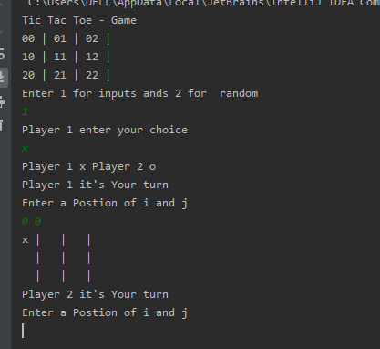

# Tic_tac_toe
<h1>It is Two Player java  based common Game </h1>

Player one choose their character from (0 and X).Try to complete 3 character in a row or diagonally. Player two try to counter Player one and find a way to win.

<h2>Output :-</h2>

